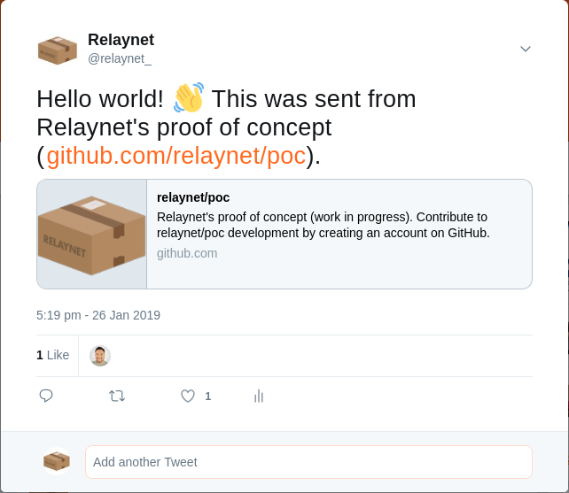
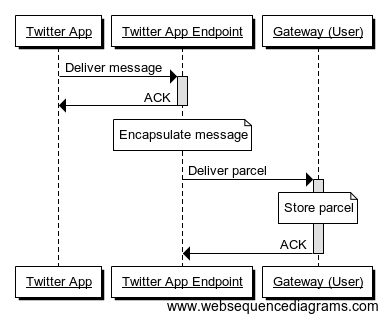
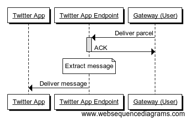
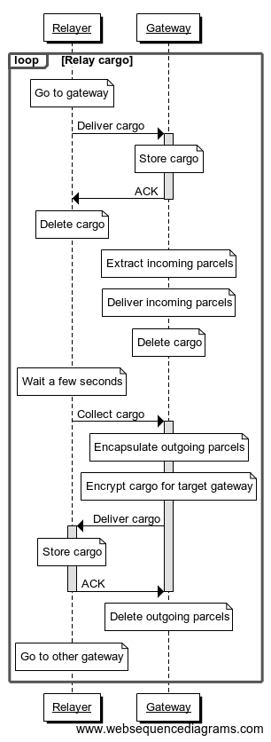
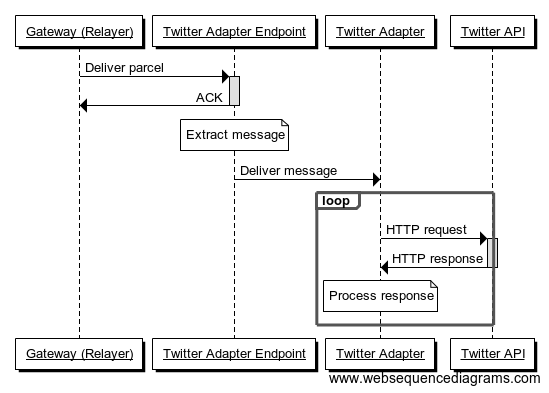
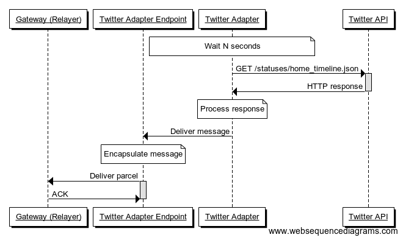

# Relaynet's Proof of Concept

This monorepo implements a proof of concept of Twitter running on [Relaynet](https://relaynet.link). It allows you to post tweets like the one below and get the latest entries from your home timeline -- And thanks to the use of messaging, the server can simply push those updates without the app having to do polling.



This a [Level 3 integration](https://github.com/relaynet/specs/blob/master/rs012-service-integration.md#level-3-third-party-messaging-adapter) on the [Relaynet Service Integration Scale](https://github.com/relaynet/specs/blob/master/rs012-service-integration.md): That is, a third party is running an adapter on top of the official Twitter API.

The Twitter app in this PoC isn't really a mobile app: It's a CLI.

## Network diagram

The following network diagram illustrates the overall system:


The [executables in this PoC](bin) match the nodes above: [`twitter-app`](bin/twitter-app), [`user-gateway`](bin/user-gateway), [`relay`](bin/relay), [`relayer-gateway`](bin/relayer-gateway) and [`twitter-api-adapter`](bin/twitter-api-adapter). Note that the _endpoints_ are libraries, so they run in the same process as their corresponding apps.

In a production environment, the adapter's endpoint could run independently, perhaps as a reverse proxy or better yet: It could communicate with the adapter through a message broker like [Amazon SQS](https://en.wikipedia.org/wiki/Amazon_Simple_Queue_Service) or [RabbitMQ](https://en.wikipedia.org/wiki/RabbitMQ).

This PoC uses [CoSocket](https://github.com/relaynet/specs/blob/master/rs004-cosocket.md) and [PogRPC](https://github.com/relaynet/specs/blob/master/rs009-pogrpc.md) for cargo relay and parcel delivery, respectively.

## Interactions

The interactions amongst the nodes in this service can be broken down into discrete processes:

### Queueing messages from the Twitter app

The user may perform actions that will result in one or more messages:



### Delivering messages to the Twitter app

An incoming cargo may contain parcels for different endpoints behind the same gateway. This is what happens with each parcel delivery:



Note that this PoC uses the [PogRPC binding](https://github.com/relaynet/specs/blob/master/rs009-pogrpc.md), so the Twitter app has to poll for updates (through its endpoint). A binding like [PoSocket](https://github.com/relaynet/specs/blob/master/rs005-posocket.md) allows the gateway to push parcels directly -- It just wouldn't have been necessary here because the Twitter app is a script that has to be run each time it's needed.

### Relaying cargo between gateways

The following diagram shows the interaction between a relayer and a gateway. Note that a single relaying gateway could serve multiple user gateways.



### Delivering messages to the Twitter API adapter



In a production environment, the endpoint must retry the delivery of the message if the adapter doesn't acknowledge its receipt.

### Delivering timeline updates

This is the process for getting timeline updates for each user that subscribes to this functionality via the Twitter app:



## How to try the PoC

First of all, set up your environment:

1. Make sure Node.js v10 and OpenSSL are available in your `$PATH`.
1. Map `twitter-3rd-party-endpoint.example.com` to the local loopback (`127.0.0.1`). On Linux this can be done by adding an entry to `/etc/hosts`.
1. [Register an OAuth app on Twitter](https://apps.twitter.com/).
1. Add a `.env` file to the root of the repo with the following content:
   ```
   # From the Twitter OAuth app
   TWITTER_CONSUMER_KEY='<your-consumer-key>'
   TWITTER_CONSUMER_SECRET='<your-consumer-secret>'
   
   # From the Twitter client
   TWITTER_ACCESS_TOKEN_KEY='<your-access-token-key>'
   TWITTER_ACCESS_TOKEN_SECRET='<your-access-token-secret>'
   ```
1. Now start the gateways and the Twitter API adapter, preferably in separate terminal sessions so you can see what's happening at all times: `bin/user-gateway`, `bin/relayer-gateway` and `bin/twitter-api-adapter`.

At this point you're ready to see Relaynet in action. You can do the following, for example:

1. Run `bin/twitter-app` to post a new tweet. The first time you run this, it will also create a message to subscribe the current app to updates to your home timeline. Subsequent calls will show any new tweets in your home timeline.
1. Run `bin/relay` to simulate the exchange of cargo between the relayer and the user's gateway. Set the `--cosocket` option to the socket path where `bin/user-gateway` is listening. For example:

   ```bash
   bin/relay \
       --cosocket=/tmp/user-gateway-data/cosocket.sock \
       --input=/tmp/usb-flashdrive/user-gw \
       --output=/tmp/usb-flashdrive/relayer-gw
   ```
1. Run `bin/relay` again, but this time to simulate the exchange of cargo between the relayer and their gateway. Make sure to set `--cosocket` to the relayer's gateway's socket path (output when you ran `bin/relayer-gateway`). For example:

   ```bash
   bin/relay \
       --cosocket=/tmp/relayer-gateway-data/cosocket.sock \
       --input=/tmp/usb-flashdrive/relayer-gw \
       --output=/tmp/usb-flashdrive/user-gw
   ```
1. Go to twitter.com and check your account. You should find your tweet there.

Repeat the process above a few times, and you'll notice how the information flows in two directions: You're now able to send and receive data from Twitter.

## Development tools

Have a look at [bin-dev/](bin-dev) if you'd like to play with some lower level aspects of Relaynet.
