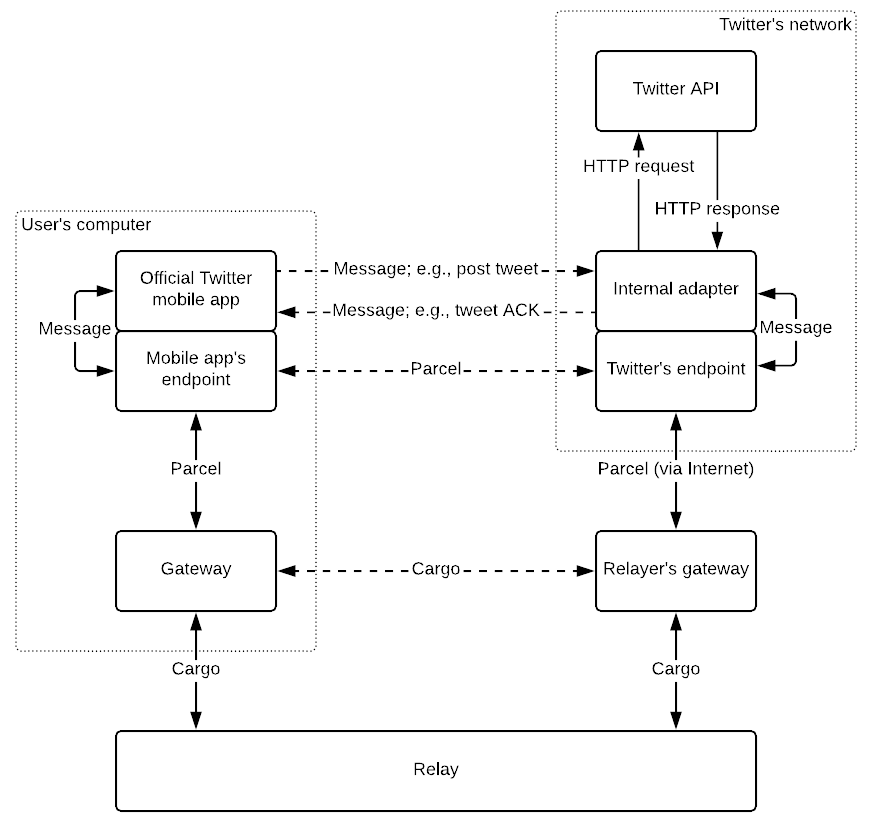
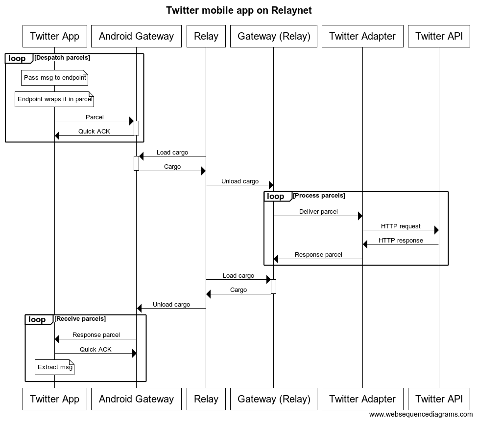
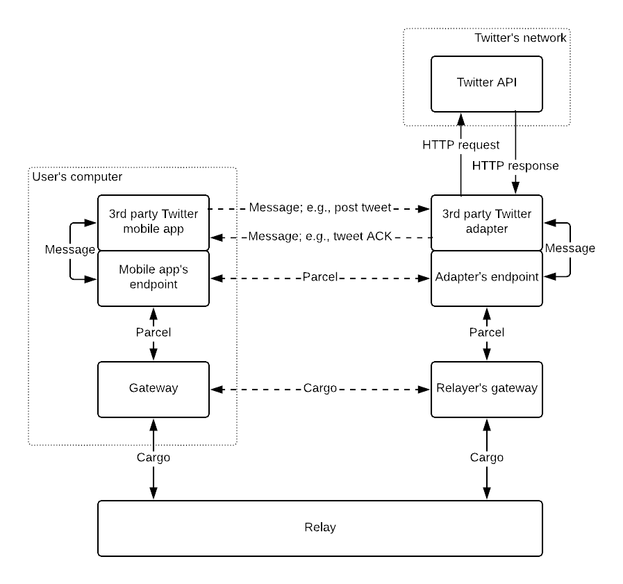

# Relaynet's Proof of Concept

This monorepo implements a proof of concept of Twitter running on [Relaynet](https://relaynet.link). It lacks  most of the basic functionality and has an unfriendly UI. Its purpose is just to validate and then improve Relaynet's effectiveness beyond the theory.

# High-Level Intro to Relaynet

Relaynet is a message-passing protocol suite that will make it possible to relay data outside the Internet, via [sneakernets](https://en.wikipedia.org/wiki/Sneakernet) or wireless systems, using end-to-end encryption. **Its designed to circumvent government-sponsored [Internet blackouts](https://www.accessnow.org/keepiton/).**

To achieve this, it will make existing and future Internet-dependent systems (e.g., social networks) tolerant to latencies lasting anywhere from hours to weeks by helping them adopt an asynchronous messaging pattern -- as opposed to the Remote Procedure Call (RPC) pattern that HTTP-based APIs depend on, which assumes a reliable connection.

The architecture draws heavily on the fields of [Delay-Tolerant Networking](https://en.wikipedia.org/wiki/Delay-tolerant_networking) and cryptography, and builds on pre-existing standards and technologies where possible, such as [X.509](https://en.wikipedia.org/wiki/X.509) and the [Cryptographic Message Syntax (CMS)](https://en.wikipedia.org/wiki/Cryptographic_Message_Syntax).

Relaynet is also the name of the [overlay](https://en.wikipedia.org/wiki/Overlay_network), [store-and-forward](https://en.wikipedia.org/wiki/Store_and_forward), [onion](https://en.wikipedia.org/wiki/Onion_routing) network resulting from the protocol suite.

## Protocol Suite Overview

TODO

## Example

There are various ways that Twitter could support Relaynet, whether officially or through a third party integration. The latter is undesirable because the communication wouldn't be completely encrypted end-to-end.

Let's consider a scenario where Twitter deployed a Relaynet _adapter_ on top of its pre-existing API. The overall system, including the user's computer or phone, would look like this:



Same example, presented as a sequence diagram:



## High-Level, Incomplete Spec

TODO

# Proof of Concept

Similar to the example above, but using an adapter run by a third party (so not completely end-to-end encrypted).



## Development utilities

### Generating private keys and certificates

The following will generate a private key with a corresponding certificate for an endpoint with an opaque address:

```bash
./bin/generate-private-node-cert rneo /tmp/endpoint_cert.pem /tmp/endpoint_key.pem
```

The following will generate a private key with a corresponding certificate for a gateway with an opaque address:

```bash
./bin/generate-private-node-cert rngo /tmp/endpoint_cert.pem /tmp/endpoint_key.pem
```

To generate a private key and a corresponding certificate for a _host endpoint_ or _host gateway_ (i.e., one whose address is a domain name or an IP address), follow the process you'd normally follow, but make sure the Relaynet address is specified in the `Subject Alternative Name` extension as a URI. For example, use `openssl` to generate a _Certificate Signing Request_ (CSR) and a private key, and send the CSR to a _Certificate Authority_ (CA).

### Generating and inspecting parcels

The following will generate a _parcel_ from the _endpoint_ E1 to the _endpoint_ E2, encrypted with E2's X.509 certificate and signed with E1's private key. The payload will be the ASCII string `Winter is coming` (but it could be anything, even a binary stream).

```bash
./bin/generate-private-node-cert rneo /tmp/e1_cert.pem /tmp/e1_key.pem
./bin/generate-private-node-cert rneo /tmp/e2_cert.pem /tmp/e2_key.pem

echo "Winter is coming" | ./bin/generate-parcel \
    --recipient-cert /tmp/e2_cert.pem \
    --sender-cert /tmp/e1_cert.pem \
    --sender-key /tmp/e1_key.pem \
    > /tmp/output.parcel
```

The parcel would've been saved to `/tmp/output.parcel`. Its contents could then be inspected and (optionally) decrypted with `inspect-message` -- for example:

```bash
./bin/inspect-message \
    --recipient-key /tmp/e2_key.pem \
    --decode-payload \
    < /tmp/output.parcel
```

Also handy during development, to detect regressions as soon as possible:

```bash
echo "Winter is coming" | ./bin/generate-parcel \
    --recipient-cert /tmp/e2_cert.pem \
    --sender-cert /tmp/e1_cert.pem \
    --sender-key /tmp/e1_key.pem \
    | \
    ./bin/inspect-message \
        --recipient-key /tmp/e2_key.pem \
        --decode-payload
```

### Generating and inspecting cargoes

The following will generate a _cargo_ from the _gateway_ G1 to the _endpoint_ G2, encrypted with G2's X.509 certificate and signed with G1's private key. The payload will be two parcels: `/tmp/01.parcel` and `/tmp/02.parcel`, which could've been created with `generate-parcel`.

```bash
./bin/generate-private-node-cert rngo /tmp/g1_cert.pem /tmp/g1_key.pem
./bin/generate-private-node-cert rngo /tmp/g2_cert.pem /tmp/g2_key.pem

./bin/generate-cargo \
    --recipient-cert /tmp/g2_cert.pem \
    --sender-cert /tmp/g1_cert.pem \
    --sender-key /tmp/g1_key.pem \
    /tmp/01.parcel \
    /tmp/02.parcel \
    > /tmp/output.cargo
```

The cargo would've been saved to `/tmp/output.cargo`. Its contents could then be inspected and (optionally) decrypted with `inspect-message` -- for example:

```bash
./bin/inspect-message \
  --recipient-key /tmp/g2_key.pem \
  --decode-payload \
  < /tmp/output.cargo
```
